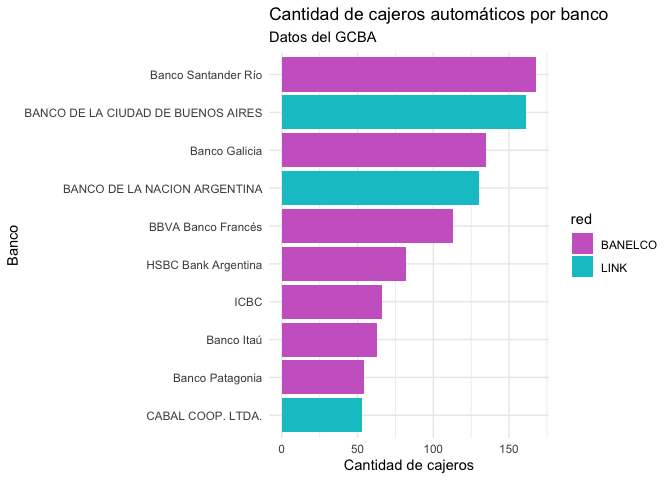

Script knitteado
================
karinabartolome
2021-05-05

``` r
#  Comentario
library(dplyr)
library(ggplot2)
df <- read.csv('https://cdn.buenosaires.gob.ar/datosabiertos/datasets/cajeros-automaticos/cajeros-automaticos.csv')
df %>% 
  group_by(banco, red) %>% 
  summarise(n=n()) %>% 
  ungroup() %>% 
  slice_max(n, n=10) %>% 
  ggplot(aes(x=reorder(banco,n),y=n, fill=red))+
    geom_col()+
    coord_flip()+
    labs(title='Cantidad de cajeros automáticos por banco', 
         subtitle='Datos del GCBA', x='Banco',y='Cantidad de cajeros')+
    theme_minimal()
```

<!-- -->
