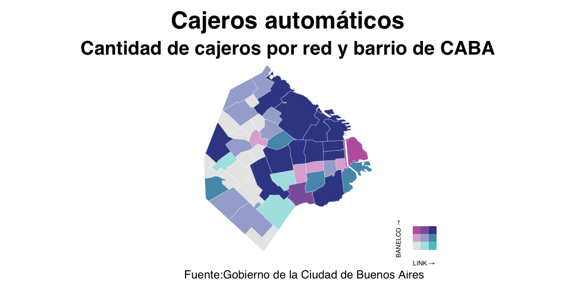
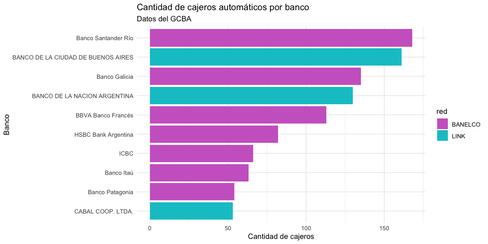

Script knitteado
================
karinabartolome
2021-05-06

``` r
library(dplyr)
library(biscale)
library(ggplot2)
library(cowplot)
library(stringr)
library(sf)
library(gt)

# Datos cajeros
df <- read.csv('https://cdn.buenosaires.gob.ar/datosabiertos/datasets/cajeros-automaticos/cajeros-automaticos.csv')
df %>% head(2) %>% gt() %>% tab_header('Cajeros automáticos en CABA')
```

<style>html {
  font-family: -apple-system, BlinkMacSystemFont, 'Segoe UI', Roboto, Oxygen, Ubuntu, Cantarell, 'Helvetica Neue', 'Fira Sans', 'Droid Sans', Arial, sans-serif;
}

#bpapwvvina .gt_table {
  display: table;
  border-collapse: collapse;
  margin-left: auto;
  margin-right: auto;
  color: #333333;
  font-size: 16px;
  font-weight: normal;
  font-style: normal;
  background-color: #FFFFFF;
  width: auto;
  border-top-style: solid;
  border-top-width: 2px;
  border-top-color: #A8A8A8;
  border-right-style: none;
  border-right-width: 2px;
  border-right-color: #D3D3D3;
  border-bottom-style: solid;
  border-bottom-width: 2px;
  border-bottom-color: #A8A8A8;
  border-left-style: none;
  border-left-width: 2px;
  border-left-color: #D3D3D3;
}

#bpapwvvina .gt_heading {
  background-color: #FFFFFF;
  text-align: center;
  border-bottom-color: #FFFFFF;
  border-left-style: none;
  border-left-width: 1px;
  border-left-color: #D3D3D3;
  border-right-style: none;
  border-right-width: 1px;
  border-right-color: #D3D3D3;
}

#bpapwvvina .gt_title {
  color: #333333;
  font-size: 125%;
  font-weight: initial;
  padding-top: 4px;
  padding-bottom: 4px;
  border-bottom-color: #FFFFFF;
  border-bottom-width: 0;
}

#bpapwvvina .gt_subtitle {
  color: #333333;
  font-size: 85%;
  font-weight: initial;
  padding-top: 0;
  padding-bottom: 4px;
  border-top-color: #FFFFFF;
  border-top-width: 0;
}

#bpapwvvina .gt_bottom_border {
  border-bottom-style: solid;
  border-bottom-width: 2px;
  border-bottom-color: #D3D3D3;
}

#bpapwvvina .gt_col_headings {
  border-top-style: solid;
  border-top-width: 2px;
  border-top-color: #D3D3D3;
  border-bottom-style: solid;
  border-bottom-width: 2px;
  border-bottom-color: #D3D3D3;
  border-left-style: none;
  border-left-width: 1px;
  border-left-color: #D3D3D3;
  border-right-style: none;
  border-right-width: 1px;
  border-right-color: #D3D3D3;
}

#bpapwvvina .gt_col_heading {
  color: #333333;
  background-color: #FFFFFF;
  font-size: 100%;
  font-weight: normal;
  text-transform: inherit;
  border-left-style: none;
  border-left-width: 1px;
  border-left-color: #D3D3D3;
  border-right-style: none;
  border-right-width: 1px;
  border-right-color: #D3D3D3;
  vertical-align: bottom;
  padding-top: 5px;
  padding-bottom: 6px;
  padding-left: 5px;
  padding-right: 5px;
  overflow-x: hidden;
}

#bpapwvvina .gt_column_spanner_outer {
  color: #333333;
  background-color: #FFFFFF;
  font-size: 100%;
  font-weight: normal;
  text-transform: inherit;
  padding-top: 0;
  padding-bottom: 0;
  padding-left: 4px;
  padding-right: 4px;
}

#bpapwvvina .gt_column_spanner_outer:first-child {
  padding-left: 0;
}

#bpapwvvina .gt_column_spanner_outer:last-child {
  padding-right: 0;
}

#bpapwvvina .gt_column_spanner {
  border-bottom-style: solid;
  border-bottom-width: 2px;
  border-bottom-color: #D3D3D3;
  vertical-align: bottom;
  padding-top: 5px;
  padding-bottom: 6px;
  overflow-x: hidden;
  display: inline-block;
  width: 100%;
}

#bpapwvvina .gt_group_heading {
  padding: 8px;
  color: #333333;
  background-color: #FFFFFF;
  font-size: 100%;
  font-weight: initial;
  text-transform: inherit;
  border-top-style: solid;
  border-top-width: 2px;
  border-top-color: #D3D3D3;
  border-bottom-style: solid;
  border-bottom-width: 2px;
  border-bottom-color: #D3D3D3;
  border-left-style: none;
  border-left-width: 1px;
  border-left-color: #D3D3D3;
  border-right-style: none;
  border-right-width: 1px;
  border-right-color: #D3D3D3;
  vertical-align: middle;
}

#bpapwvvina .gt_empty_group_heading {
  padding: 0.5px;
  color: #333333;
  background-color: #FFFFFF;
  font-size: 100%;
  font-weight: initial;
  border-top-style: solid;
  border-top-width: 2px;
  border-top-color: #D3D3D3;
  border-bottom-style: solid;
  border-bottom-width: 2px;
  border-bottom-color: #D3D3D3;
  vertical-align: middle;
}

#bpapwvvina .gt_from_md > :first-child {
  margin-top: 0;
}

#bpapwvvina .gt_from_md > :last-child {
  margin-bottom: 0;
}

#bpapwvvina .gt_row {
  padding-top: 8px;
  padding-bottom: 8px;
  padding-left: 5px;
  padding-right: 5px;
  margin: 10px;
  border-top-style: solid;
  border-top-width: 1px;
  border-top-color: #D3D3D3;
  border-left-style: none;
  border-left-width: 1px;
  border-left-color: #D3D3D3;
  border-right-style: none;
  border-right-width: 1px;
  border-right-color: #D3D3D3;
  vertical-align: middle;
  overflow-x: hidden;
}

#bpapwvvina .gt_stub {
  color: #333333;
  background-color: #FFFFFF;
  font-size: 100%;
  font-weight: initial;
  text-transform: inherit;
  border-right-style: solid;
  border-right-width: 2px;
  border-right-color: #D3D3D3;
  padding-left: 12px;
}

#bpapwvvina .gt_summary_row {
  color: #333333;
  background-color: #FFFFFF;
  text-transform: inherit;
  padding-top: 8px;
  padding-bottom: 8px;
  padding-left: 5px;
  padding-right: 5px;
}

#bpapwvvina .gt_first_summary_row {
  padding-top: 8px;
  padding-bottom: 8px;
  padding-left: 5px;
  padding-right: 5px;
  border-top-style: solid;
  border-top-width: 2px;
  border-top-color: #D3D3D3;
}

#bpapwvvina .gt_grand_summary_row {
  color: #333333;
  background-color: #FFFFFF;
  text-transform: inherit;
  padding-top: 8px;
  padding-bottom: 8px;
  padding-left: 5px;
  padding-right: 5px;
}

#bpapwvvina .gt_first_grand_summary_row {
  padding-top: 8px;
  padding-bottom: 8px;
  padding-left: 5px;
  padding-right: 5px;
  border-top-style: double;
  border-top-width: 6px;
  border-top-color: #D3D3D3;
}

#bpapwvvina .gt_striped {
  background-color: rgba(128, 128, 128, 0.05);
}

#bpapwvvina .gt_table_body {
  border-top-style: solid;
  border-top-width: 2px;
  border-top-color: #D3D3D3;
  border-bottom-style: solid;
  border-bottom-width: 2px;
  border-bottom-color: #D3D3D3;
}

#bpapwvvina .gt_footnotes {
  color: #333333;
  background-color: #FFFFFF;
  border-bottom-style: none;
  border-bottom-width: 2px;
  border-bottom-color: #D3D3D3;
  border-left-style: none;
  border-left-width: 2px;
  border-left-color: #D3D3D3;
  border-right-style: none;
  border-right-width: 2px;
  border-right-color: #D3D3D3;
}

#bpapwvvina .gt_footnote {
  margin: 0px;
  font-size: 90%;
  padding: 4px;
}

#bpapwvvina .gt_sourcenotes {
  color: #333333;
  background-color: #FFFFFF;
  border-bottom-style: none;
  border-bottom-width: 2px;
  border-bottom-color: #D3D3D3;
  border-left-style: none;
  border-left-width: 2px;
  border-left-color: #D3D3D3;
  border-right-style: none;
  border-right-width: 2px;
  border-right-color: #D3D3D3;
}

#bpapwvvina .gt_sourcenote {
  font-size: 90%;
  padding: 4px;
}

#bpapwvvina .gt_left {
  text-align: left;
}

#bpapwvvina .gt_center {
  text-align: center;
}

#bpapwvvina .gt_right {
  text-align: right;
  font-variant-numeric: tabular-nums;
}

#bpapwvvina .gt_font_normal {
  font-weight: normal;
}

#bpapwvvina .gt_font_bold {
  font-weight: bold;
}

#bpapwvvina .gt_font_italic {
  font-style: italic;
}

#bpapwvvina .gt_super {
  font-size: 65%;
}

#bpapwvvina .gt_footnote_marks {
  font-style: italic;
  font-size: 65%;
}
</style>
<div id="bpapwvvina" style="overflow-x:auto;overflow-y:auto;width:auto;height:auto;"><table class="gt_table">
  <thead class="gt_header">
    <tr>
      <th colspan="17" class="gt_heading gt_title gt_font_normal" style>Cajeros automáticos en CABA</th>
    </tr>
    <tr>
      <th colspan="17" class="gt_heading gt_subtitle gt_font_normal gt_bottom_border" style></th>
    </tr>
  </thead>
  <thead class="gt_col_headings">
    <tr>
      <th class="gt_col_heading gt_columns_bottom_border gt_center" rowspan="1" colspan="1">id</th>
      <th class="gt_col_heading gt_columns_bottom_border gt_right" rowspan="1" colspan="1">long</th>
      <th class="gt_col_heading gt_columns_bottom_border gt_right" rowspan="1" colspan="1">lat</th>
      <th class="gt_col_heading gt_columns_bottom_border gt_left" rowspan="1" colspan="1">banco</th>
      <th class="gt_col_heading gt_columns_bottom_border gt_left" rowspan="1" colspan="1">red</th>
      <th class="gt_col_heading gt_columns_bottom_border gt_left" rowspan="1" colspan="1">ubicacion</th>
      <th class="gt_col_heading gt_columns_bottom_border gt_left" rowspan="1" colspan="1">localidad</th>
      <th class="gt_col_heading gt_columns_bottom_border gt_center" rowspan="1" colspan="1">terminales</th>
      <th class="gt_col_heading gt_columns_bottom_border gt_left" rowspan="1" colspan="1">no_vidente</th>
      <th class="gt_col_heading gt_columns_bottom_border gt_left" rowspan="1" colspan="1">dolares</th>
      <th class="gt_col_heading gt_columns_bottom_border gt_left" rowspan="1" colspan="1">calle</th>
      <th class="gt_col_heading gt_columns_bottom_border gt_center" rowspan="1" colspan="1">altura</th>
      <th class="gt_col_heading gt_columns_bottom_border gt_left" rowspan="1" colspan="1">calle2</th>
      <th class="gt_col_heading gt_columns_bottom_border gt_left" rowspan="1" colspan="1">barrio</th>
      <th class="gt_col_heading gt_columns_bottom_border gt_left" rowspan="1" colspan="1">comuna</th>
      <th class="gt_col_heading gt_columns_bottom_border gt_center" rowspan="1" colspan="1">codigo_postal</th>
      <th class="gt_col_heading gt_columns_bottom_border gt_left" rowspan="1" colspan="1">codigo_postal_argentino</th>
    </tr>
  </thead>
  <tbody class="gt_table_body">
    <tr>
      <td class="gt_row gt_center">11073</td>
      <td class="gt_row gt_right">-58.37090</td>
      <td class="gt_row gt_right">-34.60581</td>
      <td class="gt_row gt_left">NUEVO BANCO DE SANTA FE S.A.</td>
      <td class="gt_row gt_left">LINK</td>
      <td class="gt_row gt_left">25 De Mayo 168</td>
      <td class="gt_row gt_left">CABA</td>
      <td class="gt_row gt_center">1</td>
      <td class="gt_row gt_left">False</td>
      <td class="gt_row gt_left">False</td>
      <td class="gt_row gt_left">25 De Mayo</td>
      <td class="gt_row gt_center">168</td>
      <td class="gt_row gt_left"></td>
      <td class="gt_row gt_left">San Nicolas</td>
      <td class="gt_row gt_left">Comuna 1</td>
      <td class="gt_row gt_center">1002</td>
      <td class="gt_row gt_left">C1002ABD</td>
    </tr>
    <tr>
      <td class="gt_row gt_center">11059</td>
      <td class="gt_row gt_right">-58.37098</td>
      <td class="gt_row gt_right">-34.60508</td>
      <td class="gt_row gt_left">BANCO DE LA NACION ARGENTINA</td>
      <td class="gt_row gt_left">LINK</td>
      <td class="gt_row gt_left">25 De Mayo 230</td>
      <td class="gt_row gt_left">CABA</td>
      <td class="gt_row gt_center">1</td>
      <td class="gt_row gt_left">False</td>
      <td class="gt_row gt_left">False</td>
      <td class="gt_row gt_left">25 De Mayo</td>
      <td class="gt_row gt_center">230</td>
      <td class="gt_row gt_left"></td>
      <td class="gt_row gt_left">San Nicolas</td>
      <td class="gt_row gt_left">Comuna 1</td>
      <td class="gt_row gt_center">1002</td>
      <td class="gt_row gt_left">C1002ABF</td>
    </tr>
  </tbody>
  
  
</table></div>

``` r
# Mapa barrios CABA
caba <- st_read('http://cdn.buenosaires.gob.ar/datosabiertos/datasets/barrios/barrios.geojson') %>% 
  mutate(barrio=str_to_title(barrio)) 
```

    ## Reading layer `barrios_badata' from data source `http://cdn.buenosaires.gob.ar/datosabiertos/datasets/barrios/barrios.geojson' using driver `GeoJSON'
    ## Simple feature collection with 48 features and 4 fields
    ## Geometry type: POLYGON
    ## Dimension:     XY
    ## Bounding box:  xmin: -58.53152 ymin: -34.70529 xmax: -58.33515 ymax: -34.52649
    ## Geodetic CRS:  WGS 84

``` r
# Cantidad de cajeros por barrio
df_barrios <- df %>% filter(localidad=='CABA') %>% 
  group_by(barrio, red) %>% 
  summarise(n=n()) %>% 
  ungroup() %>%
  filter(barrio!='') %>% 
  tidyr::pivot_wider(names_from=red, values_from=n) %>% 
  mutate(BANELCO = tidyr::replace_na(BANELCO,0), 
         LINK = tidyr::replace_na(LINK,0))

df_barrios <- merge(caba, df_barrios, by='barrio', all.x=TRUE, all.y=TRUE)

data_biscale <- bi_class(df_barrios, 
                         x='LINK',
                         y='BANELCO', 
                         style="quantile",dim=3)

# Mapa con biscale
mapa <- ggplot() +
  geom_sf(data = data_biscale, 
          mapping = aes(fill = bi_class), 
          color = "white", 
          size = 0.1, 
          show.legend = FALSE) +
  bi_scale_fill(pal = "DkBlue", dim = 3) +
  labs(title = "Cajeros automáticos",
       subtitle = "Cantidad de cajeros por red y barrio de CABA", 
       caption = "Fuente:Gobierno de la Ciudad de Buenos Aires") +
  bi_theme()+
  theme(plot.caption = element_text(hjust = 0.2))

# Legend
legend <- bi_legend(pal = "DkBlue",
                    dim = 3,
                    xlab = "LINK",
                    ylab = "BANELCO",
                    size = 8)
```

``` r
ggdraw() +
  draw_plot(mapa, 0, 0, 1, 1) +
  draw_plot(legend, 0.63, 0.05, 0.2, 0.2)
```

<!-- -->

``` r
# Cantidad de cajeros por banco
df %>% 
  group_by(banco, red) %>% 
  summarise(n=n()) %>% 
  ungroup() %>% 
  slice_max(n, n=10) %>% 
  ggplot(aes(x=reorder(banco,n),y=n, fill=red))+
  geom_col()+
  coord_flip()+
  scale_fill_manual(values=c('orchid3','turquoise3'))+
  labs(title='Cantidad de cajeros automáticos por banco', 
       subtitle='Datos del GCBA', x='Banco',y='Cantidad de cajeros')+
  theme_minimal()
```

<!-- -->
